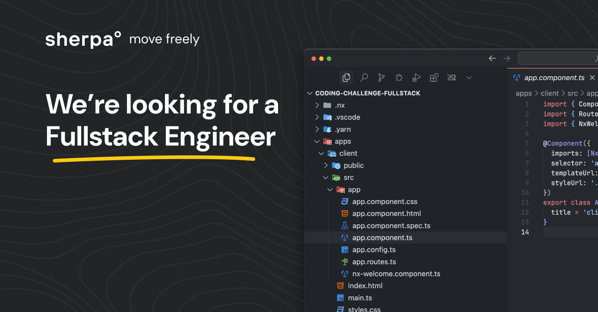

# 🌎 Fullstack Engineer Coding Challenge

## Welcome to sherpa°!

We're excited to see your skills in action! This challenge is designed to showcase your full stack expertise in a real-world scenario that reflects our mission: helping travelers cross borders freely and efficiently.

**Time Expectation:** Please spend no more than 3 hours on this challenge. We value your time and are more interested in your approach than completeness.

> Already have a project that demonstrates your skills? Skip to the [Assessment](#-assessment-criteria) section to ensure it covers the areas we're looking for.

## 🚀 The Challenge

At sherpa°, we help travelers find and purchase the visas they need. Your mission is to build a **Products Application** with both client and server components that allows users to:

- Browse all visa products (with pagination and filtering)
- View individual product details
- Edit product information
- Create new products

**Important:** We don't expect you to complete all features in the 3-hour timeframe! Choose your focus:
- Build a robust, well-structured API
- Create an intuitive, responsive UI
- Strike a balance between both

The only requirement is that your client and server components successfully integrate with each other.

## 🚦 Getting Started

Quick setup:
```
npm i -g yarn # if you don't have yarn installed
yarn
```

Running the applications:
```
npx nx run client:serve  # For the frontend
npx nx run server:serve  # For the backend
```

Need help? Contact us immediately if you encounter any setup issues!

## 🛠️ Tech Stack

This repository contains an nx monorepo with:

1. An Angular application
2. A NestJS application 
3. A CSV dataset example of visa products

Feel free to use these or swap them for your preferred frameworks. Just ensure you're working with TypeScript. The setup is intentionally minimal to give you creative freedom without having to start from scratch.

This project mimiks our own codebase, so it gives you a preview of what you can expect joining the team!

### Prefer React?
We understand you might not have all the Angular sills (yet) to hit the ground running. We deeply care about what user experience you're able to shape using technology as your tools. On the job we will support you getting up to speed with Angular.

Follow the basic steps below to install react and create a new application for you to work with in Nx.
```
npx nx add @nx/react
npx nx g @nx/react:application apps/react-client
npx nx run react-client:serve
```

### Prefer Express/Fastify/etc?
We understand you might not have all the NestJS sills (yet) to hit the ground running. We deeply care about building resilient and performant APIs that are delightful for developers to use. On the job we will support you getting up to speed with NestJS.

```
npx nx add @nx/node
npx nx g @nx/node:application apps/node-server
npx nx run node-server:serve
```

Other supported frameworks by Nx can be found [in the Nx online documentation](https://nx.dev/nx-api).

## 📊 Data

The provided CSV contains visa product information with the following fields:
- Country
- Visa Type
- Price (USD)
- Length of Stay (Days)
- Number of Entries
- Filing Fee (USD)


```
Country,Visa Type,Price (USD),Length of Stay (Days),Number of Entries,Filing Fee (USD)
USA,Tourist,160,90,Single,20
USA,Business,185,180,Multiple,25
USA,Student,350,730,Multiple,50
Canada,Tourist,100,180,Single,15
Canada,Business,150,365,Multiple,30
Canada,Student,200,1095,Multiple,40
UK,Tourist,130,180,Single,25
UK,Business,200,365,Multiple,35
UK,Student,450,1095,Multiple,55
France,Schengen,80,90,Single,10
Germany,Schengen,90,90,Multiple,12
Italy,Schengen,85,90,Single,11
Spain,Schengen,88,90,Multiple,13
Australia,Tourist,145,90,Single,18
Australia,Business,250,365,Multiple,40
Australia,Student,620,1095,Multiple,60
Japan,Tourist,30,90,Single,8
Japan,Business,55,180,Multiple,12
Japan,Student,100,730,Multiple,25
China,Tourist,140,90,Single,20
China,Business,185,180,Multiple,30
China,Student,250,1095,Multiple,45
India,Tourist,25,30,Single,5
India,Business,75,180,Multiple,10
India,Student,100,365,Multiple,20
Brazil,Tourist,40,90,Single,10
Brazil,Business,160,180,Multiple,25
Brazil,Student,200,730,Multiple,35
Russia,Tourist,50,30,Single,15
Russia,Business,150,180,Multiple,25
Russia,Student,250,1095,Multiple,40
UAE,Tourist,90,30,Single,10
UAE,Business,120,180,Multiple,15
UAE,Student,250,1095,Multiple,35
Mexico,Tourist,36,180,Single,8
Mexico,Business,100,365,Multiple,20
Mexico,Student,200,1095,Multiple,30
South Africa,Tourist,50,90,Single,12
South Africa,Business,125,180,Multiple,18
South Africa,Student,200,1095,Multiple,30
Argentina,Tourist,150,90,Single,15
Argentina,Business,180,180,Multiple,25
Argentina,Student,250,1095,Multiple,35
Thailand,Tourist,35,60,Single,5
Thailand,Business,75,180,Multiple,10
Thailand,Student,175,730,Multiple,25
Vietnam,Tourist,25,30,Single,5
Vietnam,Business,50,180,Multiple,12
Vietnam,Student,150,730,Multiple,20
```
## ✅ Assessment Criteria

Rather than looking for a complete implementation, we're evaluating your approach across these key areas and don't expect you to excell in every single one but rather focus on very few that you want to impress us with:

### Code Quality
- **Testing:** Strategic test implementation that builds confidence
- **TypeScript Usage:** Effective type definitions and interfaces
- **Code Organization:** Logical component/file structure for maintainability
- **Readability:** Clear naming conventions and function structure

### Architecture & Design
- **Developer Experience:** Documentation that enables other developers to work with your code
- **Tool Selection:** Thoughtful choices with clear rationale
- **Scalability:** Considerations for handling growth (users, products, queries)

### Professional Practice
- **Logging:** Implementation for monitoring and debugging
- **Documentation:** Clear API documentation
- **Error Handling:** Graceful handling of expected and unexpected errors

### Out of Scope
Don't worry about implementing:
- Authentication
- CI/CD pipelines
- Deployment configurations
- Extensive wireframes/prototypes

> **A note on AI:** Feel free to use AI tools if helpful—we do too! Just be prepared to discuss what worked, what didn't, and your thoughts on AI's role in development.

We're excited to see your approach and discuss your solution. Good luck!